# FootMANAGER — Full Application Overview

## 1. Project Overview

**FootMANAGER** is a platform connecting ~56 football teams to organize friendly ("amical") matches. It enables team managers to create match requests, challenge other teams, manage players, track scores through a leaderboard, and book terrains. Terrain owners manage their stadiums/schedules/bookings via a dedicated dashboard. An admin oversees the entire platform, approving managers and terrain owners.

### Tech Stack

| Layer    | Technology                           |
| -------- | ------------------------------------ |
| Frontend | React (Vite) + Tailwind CSS + Lucide React + i18next |
| Backend  | Laravel 11 API + Sanctum Auth        |
| Database | SQLite (dev) / MySQL or PostgreSQL (prod) |
| Language | Arabic (RTL by default `dir="rtl"`)  |

### Architecture

```
FootMANAGER/
├── frontend/         # React SPA (Vite)
│   └── src/
│       ├── components/   # Atomic/modular components
│       │   ├── Admin/        # Admin-specific modals
│       │   ├── Manager/      # Manager-specific modals (match, challenge, score, players)
│       │   ├── TerrainOwner/ # Terrain form modals
│       │   ├── Terrain/      # Slot picker, booking summary
│       │   ├── Booking/      # WhatsApp notice modal
│       │   ├── Calendar/     # Multi-view calendar, weekly grid
│       │   └── UI/           # Reusable (Accordion)
│       ├── pages/
│       │   ├── Auth/        # Login, Register, PendingApproval
│       │   ├── Admin/       # AdminOverview, ManagerApprovals
│       │   ├── Manager/     # Dashboard, MatchFeed, TerrainBrowse, TeamProfile, Leaderboard
│       │   └── TerrainOwner/ # Dashboard, MyTerrains, CalendarDashboard
│       ├── layouts/         # AdminLayout, ManagerLayout, TerrainOwnerLayout
│       ├── context/         # AuthContext (JWT token + user state)
│       ├── services/        # api.js (Axios instance)
│       └── locales/         # ar.json, en.json (i18n)
│
└── backend/          # Laravel 11 API
    └── app/
        ├── Http/
        │   ├── Controllers/
        │   │   ├── Auth/        # AuthController (register, login, logout, me)
        │   │   ├── Admin/       # ManagerApprovalController (approve/reject/block users)
        │   │   ├── Manager/     # MatchRequest, MatchFeed, MatchResult, TeamProfile, Player, PublicTeam
        │   │   ├── Public/      # LeaderboardController
        │   │   └── Terrain/     # Booking, DirectBooking, OwnerBooking, OwnerTerrain, TerrainOwner
        │   ├── Middleware/      # EnsureIsAdmin, EnsureManagerApproved, EnsureTerrainOwner
        │   └── Requests/       # RegisterRequest, DirectBookingRequest
        ├── Models/             # User, Team, Stadium, MatchRequest, Player, TerrainBooking, TerrainSchedule, TerrainImage
        ├── Services/           # CalendarSlotService, WhatsAppNotificationService
        └── Rules/              # NoOverlappingBooking
```

---

## 2. Use Case Diagram (Mermaid)

```mermaid
graph TB
    subgraph "🎯 FootMANAGER Platform"
        Admin[👤 Admin]
        Manager[👤 Manager]
        TerrainOwner[👤 Terrain Owner]
        Guest[👤 Guest / Unregistered]
    end

    subgraph "Authentication & Registration"
        Guest -->|Register with team info| AuthRegister[Register]
        Guest -->|Register as terrain owner| AuthRegisterOwner[Register as Terrain Owner]
        Guest -->|Login via email/phone| AuthLogin[Login]
        Manager -->|View pending status| AuthPending[View Pending Approval]
        Manager -->|Logout| AuthLogout[Logout]
        TerrainOwner -->|Logout| AuthLogout
        Admin -->|Logout| AuthLogout
    end

    subgraph "Admin Dashboard"
        Admin -->|View all managers by status| AdminList[View Managers List]
        Admin -->|Approve manager request| AdminApprove[Approve Manager]
        Admin -->|Reject manager request| AdminReject[Reject Manager]
        Admin -->|Block/unblock manager| AdminBlock[Block/Unblock Manager]
        Admin -->|View manager details| AdminDetail[View Manager Details]
        Admin -->|View platform stats| AdminStats[View Platform Stats]
        Admin -->|View terrain owners| AdminTerrainOwners[View Terrain Owners]
        Admin -->|Approve/reject terrain owner| AdminTerrainApprove[Approve/Reject Terrain Owner]
        Admin -->|Block/unblock terrain owner| AdminTerrainBlock[Block/Unblock Terrain Owner]
    end

    subgraph "Manager Dashboard"
        Manager -->|View team profile| MgrProfile[View/Edit Team Profile]
        Manager -->|Upload team logo| MgrLogo[Upload Team Logo]
        Manager -->|Create public match request| MgrCreateMatch[Create Match Request]
        Manager -->|Send direct challenge to team| MgrChallenge[Send Direct Challenge]
        Manager -->|Respond to received challenge| MgrRespondChallenge[Accept/Decline Challenge]
        Manager -->|Browse open match requests| MgrFeed[Browse Match Feed]
        Manager -->|Accept open match from feed| MgrAcceptMatch[Accept Open Match]
        Manager -->|View my match requests| MgrMyMatches[View My Requests]
        Manager -->|Cancel open match request| MgrCancel[Cancel Match Request]
        Manager -->|Submit match score| MgrSubmitScore[Submit Score]
        Manager -->|Confirm/dispute opponent score| MgrConfirmScore[Confirm/Dispute Score]
        Manager -->|View pending scores| MgrPendingScores[View Pending Scores]
        Manager -->|Manage team players| MgrPlayers[Manage Players CRUD]
        Manager -->|View leaderboard| MgrLeaderboard[View Leaderboard]
        Manager -->|Browse and book terrains| MgrTerrainBrowse[Browse & Book Terrains]
        Manager -->|Create training booking| MgrTraining[Create Training Booking]
    end

    subgraph "Terrain Owner Dashboard"
        TerrainOwner -->|View my terrains| OwnTerrains[View My Terrains]
        TerrainOwner -->|Create new terrain| OwnCreateTerrain[Create Terrain]
        TerrainOwner -->|Edit terrain details| OwnEditTerrain[Edit Terrain]
        TerrainOwner -->|Upload terrain images| OwnImages[Upload Images]
        TerrainOwner -->|Toggle terrain open/closed| OwnToggleStatus[Toggle Terrain Status]
        TerrainOwner -->|Set working hours per day| OwnWorkingHours[Set Working Hours]
        TerrainOwner -->|View calendar with bookings| OwnCalendar[View Calendar Dashboard]
        TerrainOwner -->|Approve/reject booking requests| OwnManageBooking[Manage Bookings]
        TerrainOwner -->|View upcoming bookings| OwnBookings[View Upcoming Bookings]
        TerrainOwner -->|View stats| OwnStats[View Stats]
    end

    subgraph "Public"
        Guest -->|View stadiums list| PubStadiums[View Stadiums]
        Guest -->|View public terrains| PubTerrains[View Public Terrains]
        Guest -->|View leaderboard| PubLeaderboard[View Leaderboard]
        Guest -->|View terrain slots| PubSlots[View Available Slots]
    end

    Admin -.->|Manages| Manager
    Admin -.->|Manages| TerrainOwner
```



---

## 3. Database Schema (Simplified ER)

| Table              | Key Fields |
|-------------------|------------|
| **users**         | id, name, email, phone, password, role [admin,manager,terrain_owner], status [pending,approved,rejected,blocked], is_whatsapp |
| **teams**         | id, name, manager_id -> users, primary_stadium_id -> stadiums, member_count, category, points, wins/draws/losses, goals_for/against/difference |
| **stadiums**      | id, name, city, address, capacity, owner_id -> users, price_per_team, total_price, has_*, is_open, type, player_format |
| **terrains_images** | id, terrain_id -> stadiums, image_path |
| **terrain_schedules** | id, terrain_id -> stadiums, day_of_week, open_time, close_time, slot_duration_minutes, is_active |
| **terrain_bookings** | id, terrain_id -> stadiums, manager_id -> users, team_id -> teams, booking_type, flow_type, reservation_type, booking_date/start_date/end_date, start_time/end_time, price, status |
| **match_requests** | id, host_team_id -> teams, target_team_id -> teams, opponent_team_id -> teams, stadium_id -> stadiums, type [public_request,direct_challenge], status [open,accepted,declined,completed,cancelled], score_status [none,pending_confirmation,confirmed,disputed], host_score, opponent_score |
| **players**       | id, team_id -> teams, name, position, number, phone, is_whatsapp, notes |

---

## 4. Found Loopholes & Issues

### 🚨 Critical Issues

#### 1. Direct Challenges bypass terrain booking entirely
**File:** `backend/app/Http/Controllers/Manager/MatchRequestController.php:139` (`sendChallenge`)
The `sendChallenge` method creates a `MatchRequest` but never creates a `TerrainBooking` or checks terrain conflict/availability. Event if a stadium is specified, no booking record is made, so the same time slot can be double-booked by different challenge pairs.

#### 2. Match feed acceptance does not create a booking
**File:** `backend/app/Http/Controllers/Manager/MatchFeedController.php:48` (`accept`)
When a manager accepts an open match from the feed, no `TerrainBooking` is created. The terrain availability is never reserved, leading to potential double-bookings if a match and a training session overlap.

#### 3. Challenge response also skips booking creation
**File:** `backend/app/Http/Controllers/Manager/MatchRequestController.php:183` (`respondToChallenge`)
Same issue as above — accepting a challenge sets `status = 'accepted'` and `opponent_team_id` but never creates a `TerrainBooking`.

#### 4. Race conditions on match acceptance/challenge response
Multiple managers can accept the same match request simultaneously. No database transactions or row-locking (`lockForUpdate()`) is used. Both `accept()` and `respondToChallenge()` check `status === 'open'` but don't wrap the read-then-write in a transaction with locking.

#### 5. `EnsureTerrainOwner` middleware has garbled error message
**File:** `backend/app/Http/Middleware/EnsureTerrainOwner.php:20`
```php
return response()->json(['message' => 'غير مصرح لك بالوصول至此 القسم'], 403);
```
Contains stray Chinese characters "至此 القسم". Should be `'غير مصرح لك بالوصول إلى هذا القسم'`.

### 🔶 Medium Issues

#### 6. `manager.approved` middleware does not verify role
**File:** `backend/app/Http/Middleware/EnsureManagerApproved.php`
Only checks `$user->status !== 'approved'`. A `terrain_owner` user with `approved` status could technically access manager routes if they weren't caught by route groups. Currently held safe by route grouping, but a defense-in-depth check (`$user->role === 'manager'`) is missing.

#### 7. No pagination on any list endpoints
All list endpoints (`index`, `pendingScores`, `pendingConfirmations`, leaderboard, etc.) return all results via `->get()`. With 56+ teams, this is manageable for now, but as data grows it will cause performance issues.

#### 8. Inconsistent hashing methods
**File:** `backend/app/Http/Controllers/Auth/AuthController.php`
`register()` uses `Hash::make()` (line 29) while `registerTerrainOwner()` uses `bcrypt()` (line 135). Both work but are inconsistent. `Hash::make()` is the Laravel-recommended approach.

#### 9. `.env` file is committed to the repository
The `.env` file contains database credentials and app key. Should be in `.gitignore` (it is, but the file was committed anyway).

#### 10. No email uniqueness validation on registration
**File:** `backend/app/Http/Requests/RegisterRequest.php`
Email is optional (`nullable`) but not checked for uniqueness (`'email' => 'nullable|email|max:255'`). No `unique:users,email`. Multiple users could register with the same email.

#### 11. `unblock` sets status to `approved` unconditionally
**File:** `backend/app/Http/Controllers/Admin/ManagerApprovalController.php:96`
`$user->update(['status' => 'approved'])` — This assumes unblock always means re-approve. It's fine for now but could be confusing if a previously rejected user is "unblocked" — they'd become approved even though they were never approved.

#### 12. TerrainSchedule model has mismatched fillable vs migration column names
**File:** `backend/app/Models/TerrainSchedule.php` has `open_time`/`close_time`
**Initial migration:** `2026_07_26_000001_create_terrain_schedules_table.php` has `start_time`/`end_time`
**Rename migration:** `2026_07_26_000004_add_is_open_and_rename_schedule_times.php`
This works if the rename migration ran, but the model should document this or use consistent naming from the start.

### 🔹 Minor / Cosmetic Issues

#### 13. `scopeHasConflict` is poorly named — not a real Eloquent scope
**File:** `backend/app/Models/TerrainBooking.php:103`
Defined as `public static function scopeHasConflict(...)` but used as `TerrainBooking::getConflictMessage(...)`. It doesn't follow the Eloquent scope convention (which would be called as `$query->hasConflict()`). This is a static helper, not a scope.

#### 14. Frontend: No null guard for `$user->team->id`
If a user has `role=manager` but no team (edge case), calling `$user->team->id` will throw a "Call to member function on null" error. Several controller methods assume team exists.

#### 15. No middleware checks whether manager has a team before accessing manager routes
The `EnsureManagerApproved` middleware doesn't check for the existence of a team, which could lead to N+1 or null errors in controllers that call `$user->team->id`.

#### 16. AuthContext logout on invalid token triggers another API call
**File:** `frontend/src/context/AuthContext.jsx:17`
When the token is invalid, `logout()` is called which makes a POST to `/logout` with an invalid token, causing a 401 that is caught by the interceptor and redirects to `/login`. This is redundant and could cause a loop.

### 📋 Recommendations

1. **Add `TerrainBooking` creation** in `sendChallenge()`, `accept()`, and `respondToChallenge()` to prevent double-booking.
2. **Wrap match acceptance in DB transactions with row locks** (`lockForUpdate()`) to prevent race conditions.
3. **Fix garbled Arabic text** in `EnsureTerrainOwner` middleware.
4. **Add role verification** (`$user->role === 'manager'`) in `EnsureManagerApproved`.
5. **Add pagination** via `->paginate(20)` to all list endpoints.
6. **Normalize hashing** to use `Hash::make()` consistently.
7. **Add `unique:users,email`** validation to the registration request.
8. **Add `.env` to `.gitignore`** and remove the committed `.env`.
9. **Guard `$user->team`** access with null checks in all controller methods.
10. **Rename `scopeHasConflict`** to just `hasConflict` or `checkConflict` since it's a static helper.
